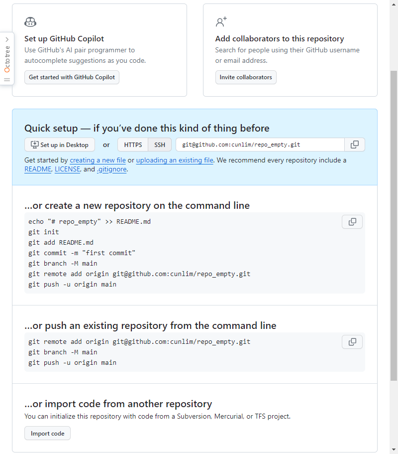

```bash
# git install in centos
yum install http://opensource.wandisco.com/centos/7/git/x86_64/wandisco-git-release-7-1.noarch.rpm
yum remove git
yum install git
git --version


# git config
# read
git config -l
git config --local -l   # ./.git/config
git config --global -l  # ~/.gitconfig
git config --system -l  # /etc/gitconfig
# write
$ git config --global --add section.key value
$ git config --global user.name "cunlim"
$ git config --global user.email "zangcunlim@gmail.com"
# delete
$ git config --global --unset section.key


# github ssh
# https://www.lainyzine.com/ko/article/creating-ssh-key-for-github/

git clone git@github.com:cunlim/repo_empty.git
git clone -b branch_name git@github.com:cunlim/repo_empty.git

cd ~/.ssh
# ssh-keygen -t rsa -C "zangcunlim@gmail.com"
ssh-keygen -t ed25519 -C "zangcunlim@gmail.com"
# Enter passphrase (empty for no passphrase):
# Enter same passphrase again:
# Your identification has been saved in ~/.ssh/id_ed25519.
cat id_ed25519.pub
# cat id_ed25519

# github make repo, add people, push
git remote add origin git@github.com:cunlim/repo_empty.git
git remote rm origin
git remote -v
git remote show origin
git remote rename old_name new_name
git branch -M main      # rename branch name

# push
git pull origin main
git push origin main
git push -u origin main
```





```md
# github make empty repo message :

Set up GitHub Copilot
Use GitHub's AI pair programmer to autocomplete suggestions as you code.
Get started with GitHub Copilot

Add collaborators to this repository
Search for people using their GitHub username or email address.
Invite collaborators

Quick setup — if you’ve done this kind of thing before
git@github.com:cunlim/repo_empty.git
Get started by creating a new file or uploading an existing file. We recommend every repository include a README, LICENSE, and .gitignore.

…or create a new repository on the command line
echo "# repo_empty" >> README.md
git init
git add README.md
git commit -m "first commit"
git branch -M main
git remote add origin git@github.com:cunlim/repo_empty.git
git push -u origin main

…or push an existing repository from the command line
git remote add origin git@github.com:cunlim/repo_empty.git
git branch -M main
git push -u origin main

…or import code from another repository
You can initialize this repository with code from a Subversion, Mercurial, or TFS project.
```


```bash
# branch
git branch dev001       # make
git branch dev001 db506e
git switch dev001
git switch -c dev001    # make and switch
git branch -d dev001    # delete

# tag
git checkout tags/v1.0

# merge
git merge dev001
git merge --abort
```


